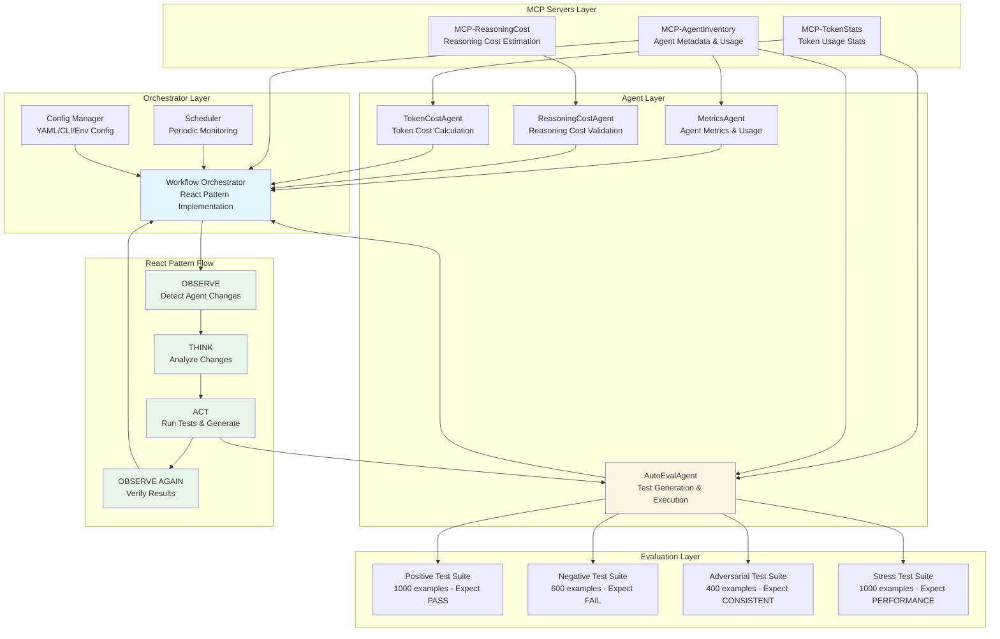
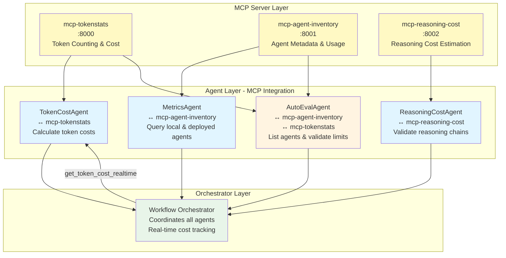
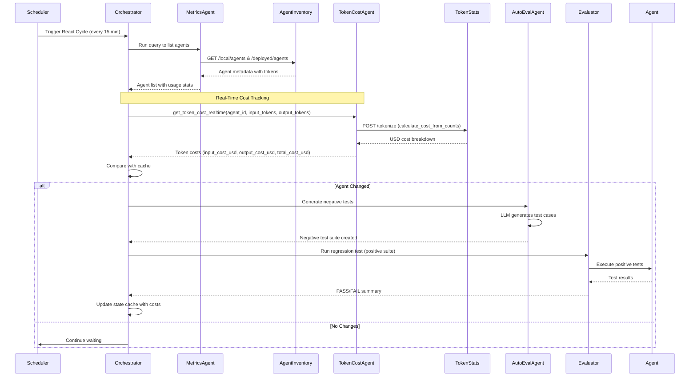

# CortexEvalAI: Automated Agent Evaluation and Testing System

## Project Overview

CortexEvalAI is a comprehensive automated evaluation and testing framework for AI agents built with Google ADK (Agent Development Kit). The system implements a React pattern (Reasoning and Acting) orchestrator that monitors agent changes, automatically generates evaluation test suites, and runs regression tests to ensure agent quality and reliability.

### Key Components

- **Workflow Orchestrator**: Coordinates multiple agents in parallel and implements React pattern for automatic monitoring
- **AutoEvalAgent**: Dynamically generates evaluation test suites (positive, negative, adversarial, stress) using LLM
- **MCP Servers**: Microservices for agent inventory tracking, token statistics, and reasoning cost estimation
- **Agent Ecosystem**: Four specialized agents (MetricsAgent, ReasoningCostAgent, TokenCostAgent, AutoEvalAgent) working in parallel with dedicated MCP server interfaces

### Architecture

### React Pattern Flow Diagram

## Problem Statement

### Challenges in AI Agent Development

Modern AI agent development faces several critical challenges:

1. **Lack of Automated Testing**: Traditional software testing methodologies don't fully apply to AI agents, which require evaluation of reasoning quality, consistency, and hallucination detection rather than simple pass/fail tests.

2. **Manual Test Suite Creation**: Creating comprehensive test suites for agents is time-consuming and doesn't scale well as agents evolve and change over time.

3. **No Automated Regression Testing**: When agent configurations, code, or deployments change, there's no automatic mechanism to verify that existing functionality still works correctly.

4. **Inconsistent Test Coverage**: Different test types (positive, negative, adversarial, stress) require different approaches and are often inconsistently implemented across agents.

5. **Monitoring and Change Detection**: There's no automated system to detect when agents are modified, redeployed, or reconfigured, requiring manual intervention to trigger tests.

6. **Token Limit Management**: Agents need to handle various input sizes, including edge cases that exceed token limits, but there's no systematic way to test these scenarios.

7. **Hallucination and Consistency Detection**: Agents must maintain consistency and avoid hallucinations when presented with adversarial inputs, but detecting these issues requires specialized test cases.

### Impact

These challenges result in:
- **Reduced Agent Reliability**: Bugs and regressions go undetected until production
- **Increased Development Time**: Manual testing slows down iteration cycles
- **Inconsistent Quality**: Different agents have different levels of test coverage
- **High Maintenance Cost**: Manual test creation and maintenance is expensive
- **Poor Scalability**: As the number of agents grows, manual testing becomes unsustainable

## Solution Statement

### CortexEvalAI: Comprehensive Automated Evaluation Framework

CortexEvalAI addresses these challenges through an integrated system that automates the entire agent evaluation lifecycle.

### Core Solutions

#### 1. Dynamic Test Suite Generation via LLM

**Problem**: Manual test suite creation is time-consuming and doesn't scale.

**Solution**: AutoEvalAgent uses Google ADK to dynamically generate diverse test cases based on:
- Agent capabilities and description from AgentInventory MCP
- Success scenarios for the agent's domain
- Diverse task types (multi-doc QA, summarization, classification, extraction)

**Key Features**:
- **Positive Test Suite (1000 examples)**: Valid tasks that should PASS
- **Negative Test Suite (600 examples)**: Corrupt JSON, reversed instructions, misleading labels, missing fields, token-limit overflow prompts
- **Adversarial Test Suite (400 examples)**: Contradictory facts, distractor paragraphs, random noise, Unicode edge cases
- **Stress Test Suite (1000 examples)**: Long-context (512-4096 tokens), deep reasoning (10+ steps), chain tests

#### 2. React Pattern for Automatic Change Detection

**Problem**: No automated system to detect and respond to agent changes.

**Solution**: Workflow Orchestrator implements React pattern (OBSERVE → THINK → ACT → OBSERVE) that:
- Monitors all agents for configuration, code, or redeployment changes
- Compares current state with cached state using config hashes and timestamps
- Automatically triggers regression tests when changes are detected
- Generates negative test cases dynamically when needed

**React Pattern Implementation**:
1. **OBSERVE**: `detect_agent_changes()` monitors agents via AgentInventory MCP
2. **THINK**: Analyzes change types (config_changed, redeployed, new_agent)
3. **ACT**: Executes regression tests (positive suite - expect PASS) and generates negative tests
4. **OBSERVE AGAIN**: Verifies results and updates state cache

#### 3. Scheduled Periodic Monitoring

**Problem**: Manual triggering of tests requires human intervention.

**Solution**: Configurable scheduler runs React cycles automatically every 15 minutes (configurable via config.yaml, CLI, or environment variables).

**Configuration Options**:
- YAML config file (`config.yaml`)
- CLI arguments (`--scheduler --interval 30`)
- Environment variables (`ORCHESTRATOR_INTERVAL_MINUTES=30`)

#### 4. MCP Server Integration for Monitoring

**Problem**: No centralized way to track agent metadata and usage.

**Solution**: Integration with MCP (Model Control Protocol) servers with dedicated agent-to-server mapping:
- **MCP-AgentInventory** (`http://localhost:8001`): Tracks agent metadata, usage statistics, and last run times
  - **Accessed by**: MetricsAgent
  - **Endpoints**: `/local/agents`, `/deployed/agents`, `/local/agents/{id}/usage`, `/deployed/agents/{id}/usage`
  - **Integration**: MetricsAgent queries both local (in-memory) and deployed (GCP Reasoning Engine) agents
- **MCP-TokenStats** (`http://localhost:8000`): Calculates token counts and actual USD costs using official Gemini API pricing
  - **Accessed by**: TokenCostAgent
  - **Capabilities**: Token counting, cost calculation from token counts, extended pricing tier support
  - **Integration**: TokenCostAgent provides real-time token cost calculations for orchestrator
- **MCP-ReasoningCost** (`http://localhost:8002`): Estimates reasoning costs based on chain-of-thought metrics
  - **Accessed by**: ReasoningCostAgent
  - **Capabilities**: Relative cost scoring, actual USD cost calculation when tokens provided, runaway detection
  - **Integration**: ReasoningCostAgent validates reasoning chains and estimates costs

**Agent-to-MCP Server Interface Mapping**:
| Agent | MCP Server | Primary Purpose |
|-------|-----------|----------------|
| **MetricsAgent** | `mcp-agent-inventory` | Retrieve agent usage statistics, metrics, and inventory |
| **ReasoningCostAgent** | `mcp-reasoning-cost` | Estimate reasoning costs and validate chains |
| **TokenCostAgent** | `mcp-tokenstats` | Calculate token counts and LLM costs |
| **AutoEvalAgent** | `mcp-agent-inventory`, `mcp-tokenstats` | List agents, validate token limits |

#### 5. Parallel Agent Orchestration with Real-Time Cost Tracking

**Problem**: Agents need to work together efficiently in complex workflows with cost visibility.

**Solution**: Workflow Orchestrator coordinates multiple agents in parallel with integrated cost tracking:
- **Four Agents Working in Parallel**: MetricsAgent, ReasoningCostAgent, TokenCostAgent, and AutoEvalAgent execute simultaneously
- **Real-Time Token Cost Calculation**: When MetricsAgent pulls agent usage, the orchestrator automatically calls TokenCostAgent to calculate actual USD costs
- **Cost Integration Flow**: 
  1. MetricsAgent → queries `mcp-agent-inventory` → gets agent usage (input/output tokens)
  2. Orchestrator → calls `get_token_cost_realtime()` → calls TokenCostAgent
  3. TokenCostAgent → queries `mcp-tokenstats` → calculates actual USD cost
  4. Returns comprehensive cost breakdown: `input_cost_usd`, `output_cost_usd`, `total_cost_usd`
- **Results Synthesis**: Results from all agents are combined and synthesized for comprehensive insights
- **Error Handling**: Robust error handling ensures partial failures don't block entire workflows

### Technical Architecture

#### Agent-to-MCP Server Interface Diagram

#### Component Interaction Flow

### Key Innovations

1. **LLM-Based Dynamic Generation**: Test cases are generated dynamically by an LLM, ensuring diversity and relevance to each agent's capabilities.

2. **Zero-Write Policy for Existing Agents**: Eval sets are not overwritten for existing agents unless explicitly requested, preserving test consistency.

3. **Automatic Regression Testing**: Positive test suites are automatically run when changes are detected, ensuring backward compatibility.

4. **Configurable Scheduler**: Flexible configuration allows for different monitoring intervals and behaviors based on project needs.

5. **React Pattern Implementation**: Structured approach to monitoring and responding ensures consistent, reliable agent evaluation.

6. **Centralized Configuration**: All agents use a centralized `config.py` module with `AGENT_MODEL` environment variable, enabling model changes across all agents without code modifications.

7. **Dedicated Agent-to-MCP Server Interfaces**: Each agent has a specialized MCP server interface:
   - **MetricsAgent** ↔ `mcp-agent-inventory`: Unified interface for local and deployed agent inventory
   - **ReasoningCostAgent** ↔ `mcp-reasoning-cost`: Reasoning cost estimation with USD cost calculation
   - **TokenCostAgent** ↔ `mcp-tokenstats`: Token counting and cost calculation with official Gemini pricing
   - **AutoEvalAgent** ↔ Multiple MCP servers: Agent inventory and token validation

8. **Real-Time Cost Tracking**: Integrated token cost calculation during runtime - when agents are retrieved, their usage tokens are automatically converted to USD costs using official LLM pricing models.

## Conclusion

### Achievements

CortexEvalAI successfully addresses the critical challenges in AI agent development by providing:

✅ **Automated Test Generation**: LLM-based dynamic test suite creation eliminates manual effort  
✅ **Change Detection**: Automatic monitoring of agent changes through React pattern  
✅ **Regression Testing**: Automatic validation when agents are modified or redeployed  
✅ **Comprehensive Coverage**: Four test types (positive, negative, adversarial, stress) ensure thorough evaluation  
✅ **Scalability**: System scales automatically as new agents are added  
✅ **Configurability**: Flexible configuration via YAML, CLI, or environment variables  
✅ **Integration**: Seamless integration with MCP servers for monitoring and statistics  
✅ **Centralized Configuration**: Single `AGENT_MODEL` environment variable controls all agents  
✅ **Real-Time Cost Tracking**: Automatic USD cost calculation during agent usage retrieval  
✅ **Dedicated Agent Interfaces**: Each agent has a specialized MCP server interface for optimal functionality  

### Impact

The system provides significant benefits:

- **Reduced Development Time**: Automated test generation and execution saves hours of manual work
- **Improved Agent Quality**: Comprehensive test coverage catches bugs before production
- **Better Scalability**: System handles growing number of agents without proportional increase in effort
- **Consistent Evaluation**: Standardized approach ensures all agents are evaluated uniformly
- **Proactive Monitoring**: Automatic change detection enables rapid response to issues

### Future Enhancements

Potential areas for future development:

1. **Advanced Test Generation**: Incorporate agent-specific templates and domain knowledge
2. **Performance Metrics**: Add detailed performance tracking and reporting
3. **CI/CD Integration**: Direct integration with continuous integration pipelines
4. **Test Result Analysis**: ML-based analysis of test results to identify patterns and trends
5. **Multi-Agent Workflow Testing**: Evaluate complex multi-agent interactions and dependencies
6. **Custom Test Types**: Allow users to define custom test suite types based on specific requirements

### Final Thoughts

CortexEvalAI represents a significant step forward in AI agent development and evaluation. By combining the power of LLM-based generation, React pattern monitoring, and comprehensive test suites, the system provides a robust foundation for building reliable, high-quality AI agents at scale.

The automated nature of the system frees developers to focus on agent logic and capabilities rather than test maintenance, while the React pattern ensures that changes are detected and validated automatically. This combination of automation and reliability makes CortexEvalAI an essential tool for modern AI agent development.

---

**Project Repository**: [GitHub - CortexEvalAI](https://github.com/nareshsaladi2024/CortexEvalAI)  
**Technology Stack**: Google ADK, Vertex AI, Python, FastAPI, MCP Servers  
**License**: MIT

