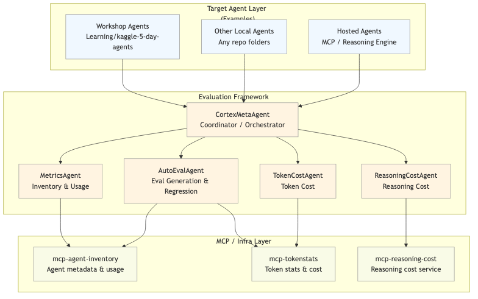
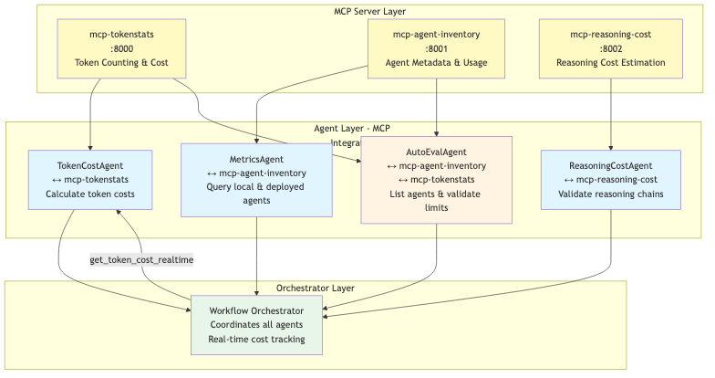

# CortexMetaAgent: Automated Agent Evaluation and Testing System

**Automated AI agent evaluation framework measuring cost, quality, and performance through token/reasoning costs, usage analytics, and comprehensive evaluation tests.**

## Project Overview

CortexMetaAgent is a comprehensive automated evaluation and testing framework for AI agents built with Google ADK (Agent Development Kit). The system implements a React pattern (Reasoning and Acting) orchestrator that monitors agent changes, automatically generates evaluation test suites, and runs regression tests to ensure agent quality and reliability.

### Key Components

- **CortexMetaAgent**: Unified coordinator agent that orchestrates all specialized agents for comprehensive cross-platform agent governance
- **Workflow Orchestrator**: Coordinates multiple agents in parallel and implements React pattern for automatic monitoring
- **AutoEvalAgent**: Dynamically generates evaluation test suites (positive, negative, adversarial, stress) using LLM
- **MCP Servers**: Microservices for agent inventory tracking, token statistics, and reasoning cost estimation
- **Agent Ecosystem**: Three specialized agents (MetricsAgent, ReasoningCostAgent, AutoEvalAgent) working in parallel with dedicated MCP server interfaces, all orchestrated by CortexMetaAgent

### Architecture



### React Pattern Flow Diagram


## Problem Statement

### Challenges in AI Agent Development

Modern AI agent development faces several critical challenges:

1. **Lack of Automated Testing**: Traditional software testing methodologies don't fully apply to AI agents, which require evaluation of reasoning quality, consistency, and hallucination detection rather than simple pass/fail tests.

2. **Manual Test Suite Creation**: Creating comprehensive test suites for agents is time-consuming and doesn't scale well as agents evolve and change over time.

3. **No Automated Regression Testing**: When agent configurations, code, or deployments change, there's no automatic mechanism to verify that existing functionality still works correctly.

4. **Inconsistent Test Coverage**: Different test types (positive, negative, adversarial, stress) require different approaches and are often inconsistently implemented across agents.

5. **Monitoring and Change Detection**: There's no automated system to detect when agents are modified, redeployed, or reconfigured, requiring manual intervention to trigger tests.

6. **Token Limit Management**: Agents need to handle various input sizes, including edge cases that exceed token limits, but there's no systematic way to test these scenarios.

7. **Hallucination and Consistency Detection**: Agents must maintain consistency and avoid hallucinations when presented with adversarial inputs, but detecting these issues requires specialized test cases.

### Impact

These challenges result in:
- **Reduced Agent Reliability**: Bugs and regressions go undetected until production
- **Increased Development Time**: Manual testing slows down iteration cycles
- **Inconsistent Quality**: Different agents have different levels of test coverage
- **High Maintenance Cost**: Manual test creation and maintenance is expensive
- **Poor Scalability**: As the number of agents grows, manual testing becomes unsustainable

## Solution Statement

### CortexMetaAgent: Comprehensive Automated Evaluation Framework

CortexMetaAgent addresses these challenges through an integrated system that automates the entire agent evaluation lifecycle.

### Core Solutions

#### 1. Dynamic Test Suite Generation via LLM

**Problem**: Manual test suite creation is time-consuming and doesn't scale.

**Solution**: AutoEvalAgent uses Google ADK to dynamically generate diverse test cases based on:
- Agent capabilities and description from AgentInventory MCP
- Success scenarios for the agent's domain
- Diverse task types (multi-doc QA, summarization, classification, extraction)

**Key Features**:
- **Positive Test Suite (1000 examples)**: Valid tasks that should PASS
- **Negative Test Suite (600 examples)**: Corrupt JSON, reversed instructions, misleading labels, missing fields, token-limit overflow prompts
- **Adversarial Test Suite (400 examples)**: Contradictory facts, distractor paragraphs, random noise, Unicode edge cases
- **Stress Test Suite (1000 examples)**: Long-context (512-4096 tokens), deep reasoning (10+ steps), chain tests

#### 2. React Pattern for Automatic Change Detection

**Problem**: No automated system to detect and respond to agent changes.

**Solution**: Workflow Orchestrator implements React pattern (OBSERVE → THINK → ACT → OBSERVE) that:
- Monitors all agents for configuration, code, or redeployment changes
- Compares current state with cached state using config hashes and timestamps
- Automatically triggers regression tests when changes are detected
- Generates negative test cases dynamically when needed

**React Pattern Implementation**:
1. **OBSERVE**: `detect_agent_changes()` monitors agents via AgentInventory MCP
2. **THINK**: Analyzes change types (config_changed, redeployed, new_agent)
3. **ACT**: Executes regression tests (positive suite - expect PASS) and generates negative tests
4. **OBSERVE AGAIN**: Verifies results and updates state cache

#### 3. Scheduled Periodic Monitoring

**Problem**: Manual triggering of tests requires human intervention.

**Solution**: Configurable scheduler runs React cycles automatically every 15 minutes (configurable via config.yaml, CLI, or environment variables).

**Configuration Options**:
- YAML config file (`config.yaml`)
- CLI arguments (`--scheduler --interval 30`)
- Environment variables (`ORCHESTRATOR_INTERVAL_MINUTES=30`)

#### 4. MCP Server Integration for Monitoring

**Problem**: No centralized way to track agent metadata and usage.

**Solution**: Integration with MCP (Model Control Protocol) servers with dedicated agent-to-server mapping:
- **MCP-AgentInventory** (`http://localhost:8001`): Tracks agent metadata, usage statistics, and last run times
  - **Accessed by**: MetricsAgent
  - **Endpoints**: `/local/agents`, `/deployed/agents`, `/local/agents/{id}/usage`, `/deployed/agents/{id}/usage`
  - **Integration**: MetricsAgent queries both local (in-memory) and deployed (GCP Reasoning Engine) agents

- **MCP-ReasoningCost** (`http://localhost:8002`): Estimates reasoning costs based on chain-of-thought metrics
  - **Accessed by**: ReasoningCostAgent
  - **Capabilities**: Relative cost scoring, actual USD cost calculation when tokens provided, runaway detection
  - **Integration**: ReasoningCostAgent validates reasoning chains and estimates costs

**Agent-to-MCP Server Interface Mapping**:
| Agent | MCP Server | Primary Purpose |
|-------|-----------|----------------|
| **MetricsAgent** | `mcp-agent-inventory` | Retrieve agent usage statistics, metrics, and inventory |
| **ReasoningCostAgent** | `mcp-reasoning-cost` | Estimate reasoning costs and validate chains |
| **AutoEvalAgent** | `mcp-agent-inventory` | List agents, validate token limits |

#### 5. Parallel Agent Orchestration with Real-Time Cost Tracking

**Problem**: Agents need to work together efficiently in complex workflows with cost visibility.

**Solution**: Workflow Orchestrator coordinates multiple agents in parallel with integrated cost tracking:
- **Three Agents Working in Parallel**: MetricsAgent, ReasoningCostAgent, and AutoEvalAgent execute simultaneously
- **Results Synthesis**: Results from all agents are combined and synthesized for comprehensive insights
- **Error Handling**: Robust error handling ensures partial failures don't block entire workflows

### Technical Architecture

#### Agent-to-MCP Server Interface Diagram



#### Component Interaction Flow


## CortexMetaAgent: How It Differs From Existing Agent Monitoring Tools

### Overview

CortexMetaAgent is a unified coordinator agent that orchestrates the entire agent evaluation and monitoring ecosystem. Unlike traditional monitoring tools that focus on single aspects of agent performance, CortexMetaAgent provides comprehensive cross-platform governance by coordinating multiple specialized agents in a structured workflow.

### Key Differences from Existing Tools

Existing frameworks such as **Langfuse**, **Helicone**, **Langwatch**, and **AgentOps** provide observability, logging, token tracking, and performance monitoring. However, they lack autonomous reasoning, orchestration, evaluation, and optimization. **CortexMetaAgent acts on data—not just observes it.**

Traditional agent monitoring tools typically focus on:
- **Single Metrics**: Only tracking one type of metric (e.g., just token usage or just error rates)
- **Reactive Monitoring**: Waiting for issues to occur before alerting
- **Platform-Specific**: Tied to a single deployment platform or framework
- **Manual Analysis**: Requiring human intervention to correlate different metrics
- **Static Test Suites**: Using fixed test cases that don't evolve with agents
- **Passive Observation**: Logging and monitoring without taking action

CortexMetaAgent fundamentally differs by:
- **Unified Orchestration**: Coordinates multiple specialized agents (MetricsAgent, AutoEvalAgent, ReasoningCostAgent) in parallel and sequential patterns
- **Proactive Evaluation**: Automatically generates and extends test suites based on agent changes
- **Cross-Platform Governance**: Works with local agents, deployed agents (GCP Reasoning Engine), and MCP-based agents
- **Intelligent Synthesis**: Automatically correlates metrics, costs, and evaluation results into actionable insights
- **Dynamic Test Generation**: Continuously evolves test suites to match agent capabilities
- **Autonomous Action**: Takes decisions and optimizes the system automatically, not just observes it

### What Existing Tools Do

Existing agent monitoring and evaluation tools typically provide:

1. **Log agent requests and responses**: Record interactions for debugging and analysis
2. **Track token usage and latency**: Monitor resource consumption and performance metrics
3. **Provide dashboards and analytics**: Visualize agent behavior and trends
4. **Offer traces for debugging**: Enable detailed inspection of agent execution paths
5. **Monitor a single agent or workflow**: Focus on individual agent performance
6. **Basic Metrics Tracking**: Simple counters for runs, failures, latency
7. **Error Logging**: Simple error tracking and alerting
8. **Static Dashboards**: Pre-configured views that don't adapt to agent changes
9. **Reactive Alerts**: Notifications only after problems occur

These tools are valuable but **passive—they do not improve the system by themselves.**

### What CortexMetaAgent Adds

CortexMetaAgent extends beyond traditional monitoring by providing:

1. **Intelligent Agent Orchestration**:
   - **Parallel Execution**: Runs MetricsAgent and ReasoningCostAgent simultaneously for efficiency
   - **Sequential Refinement**: Uses AutoEvalAgent to extend test suites and run regressions based on gathered metrics
   - **Context-Aware Workflows**: Synthesizes inventory, usage, and cost data before making evaluation decisions

2. **Automated Test Suite Evolution**:
   - **Dynamic Test Generation**: AutoEvalAgent generates new test cases based on agent capabilities and failure patterns
   - **Versioned Test Suites**: Never overwrites existing tests; adds new versions to track evolution
   - **Comprehensive Coverage**: Generates positive, negative, adversarial, and stress test suites automatically

3. **Unified Cost Analysis**:

   - **Reasoning Cost Estimation**: Validates reasoning chains and estimates action costs
   - **Cost-Performance Correlation**: Links cost metrics with performance metrics for optimization insights

4. **Cross-Platform Agent Inventory**:
   - **Unified Agent Discovery**: Discovers agents across local repositories, deployed services, and MCP servers
   - **Usage Pattern Analysis**: Tracks usage statistics, failure modes, and success rates across all platforms
   - **Deployment State Tracking**: Monitors agent deployment status and configuration changes

5. **Proactive Regression Testing**:
   - **Automatic Change Detection**: Monitors agents for configuration, code, or redeployment changes
   - **Immediate Regression Validation**: Runs positive test suites when changes are detected
   - **Failure Mode Analysis**: Identifies patterns in failures to guide test generation

6. **Intelligent Synthesis and Reporting**:
   - **Per-Agent Summaries**: Compact tables showing eval coverage, reasoning/cost metrics, token costs, and recommended actions
   - **Contextual Recommendations**: Suggests next actions based on synthesized metrics and evaluation results
   - **Failure Mode Documentation**: Tracks known failure modes and cost profiles per agent

7. **Autonomous Evaluation and Optimization**:
   - **Autonomous evaluation of agent outputs**: Uses LLM-based evaluation to assess quality, consistency, and correctness without human intervention
   - **Multi-agent comparison for cost/quality trade-offs**: Compares multiple agents on the same tasks to identify optimal cost-performance ratios
   - **Workflow orchestration and agent routing**: Intelligently routes tasks to the most appropriate agent based on capabilities, cost, and performance
   - **Reasoning validation and hallucination detection**: Validates reasoning chains and detects inconsistencies or hallucinations in agent outputs
   - **Parallel evaluation through multi-agent consensus**: Uses multiple evaluators in parallel to ensure robust assessment
   - **Governance and policy enforcement across agents**: Enforces quality standards, cost limits, and operational policies across all agents

### Unified Cross-Platform Agent Governance

CortexMetaAgent provides unified governance across multiple agent deployment platforms:

#### Multi-Platform Support

CortexMetaAgent connects agents from:

- **Google ADK / Agent Runtime**: Native integration with Google's agent development framework
- **Vertex AI**: Cloud-based agent deployment and execution
- **OpenAI / Anthropic**: Support for third-party LLM providers
- **Local LLMs**: Integration with locally deployed models
- **MCP servers and custom tools**: Extensible architecture for custom integrations
- **Local Agents**: Monitors agents in local repositories and development environments
- **Deployed Agents**: Tracks agents deployed to GCP Reasoning Engine (Vertex AI)
- **MCP-Based Agents**: Integrates with agents exposed through Model Control Protocol servers
- **Hybrid Environments**: Seamlessly works across mixed deployment scenarios

It becomes the **single control plane** for managing agent intelligence, performance, and cost across heterogeneous environments.

#### Unified Workflow Pattern

```
1. Parallel Metrics Gathering
   ├── MetricsAgent → Agent inventory & usage stats
   ├── ReasoningCostAgent → Reasoning chain analysis


2. Sequential Evaluation & Testing
   └── AutoEvalAgent → Test generation & regression testing
       (uses synthesized context from parallel stage)

3. Synthesis & Reporting
   └── Per-agent summary with recommendations
```

#### Governance Capabilities

1. **Consistent Evaluation Standards**: All agents, regardless of platform, are evaluated using the same comprehensive test suites
2. **Cross-Platform Cost Visibility**: Unified cost tracking across local and deployed agents
3. **Centralized Change Management**: Single point of monitoring for all agent changes across platforms
4. **Unified Reporting**: Consistent reporting format regardless of agent deployment location
5. **Platform-Agnostic Test Generation**: Test suites work across all platforms through standardized interfaces

#### Autonomous Optimization Layer

Unlike monitoring tools, CortexMetaAgent actively improves the system:

- **Reroutes tasks to cheaper or more accurate agents**: Dynamically selects optimal agents based on real-time performance and cost data
- **Re-evaluates outputs when uncertainty is detected**: Automatically flags and re-processes uncertain or low-confidence results
- **Optimizes cost per workflow based on real usage**: Continuously adjusts agent selection to minimize cost while maintaining quality
- **Identifies failing prompts or agents automatically**: Detects degradation patterns and triggers alerts or automatic remediation
- **Generates new test cases when gaps are found**: Proactively identifies coverage gaps and generates targeted test cases

#### Architecture Integration

CortexMetaAgent sits at the top of the CortexMetaAgent architecture, orchestrating all specialized agents:


### Summary: CortexMetaAgent vs. Existing Tools

**Existing tools observe. CortexMetaAgent acts.**

**Existing tools measure quality. CortexMetaAgent improves it.**

**Existing tools show cost. CortexMetaAgent optimizes it.**

**Existing tools track agents individually. CortexMetaAgent orchestrates agents collectively.**

This positions CortexMetaAgent as a new operational intelligence layer above current AI observability solutions, transforming passive monitoring into active governance and optimization.

### Key Innovations

1. **LLM-Based Dynamic Generation**: Test cases are generated dynamically by an LLM, ensuring diversity and relevance to each agent's capabilities.

2. **Zero-Write Policy for Existing Agents**: Eval sets are not overwritten for existing agents unless explicitly requested, preserving test consistency.

3. **Automatic Regression Testing**: Positive test suites are automatically run when changes are detected, ensuring backward compatibility.

4. **Configurable Scheduler**: Flexible configuration allows for different monitoring intervals and behaviors based on project needs.

5. **React Pattern Implementation**: Structured approach to monitoring and responding ensures consistent, reliable agent evaluation.

6. **Centralized Configuration**: All agents use a centralized `config.py` module with `AGENT_MODEL` environment variable, enabling model changes across all agents without code modifications.

7. **Dedicated Agent-to-MCP Server Interfaces**: Each agent has a specialized MCP server interface:
   - **MetricsAgent** ↔ `mcp-agent-inventory`: Unified interface for local and deployed agent inventory
   - **ReasoningCostAgent** ↔ `mcp-reasoning-cost`: Reasoning cost estimation with USD cost calculation
   - **AutoEvalAgent** ↔ Multiple MCP servers: Agent inventory and token validation


## Conclusion

### Achievements

CortexMetaAgent successfully addresses the critical challenges in AI agent development by providing:

✅ **Automated Test Generation**: LLM-based dynamic test suite creation eliminates manual effort  
✅ **Change Detection**: Automatic monitoring of agent changes through React pattern  
✅ **Regression Testing**: Automatic validation when agents are modified or redeployed  
✅ **Comprehensive Coverage**: Four test types (positive, negative, adversarial, stress) ensure thorough evaluation  
✅ **Scalability**: System scales automatically as new agents are added  
✅ **Configurability**: Flexible configuration via YAML, CLI, or environment variables  
✅ **Integration**: Seamless integration with MCP servers for monitoring and statistics  
✅ **Centralized Configuration**: Single `AGENT_MODEL` environment variable controls all agents  
  
✅ **Dedicated Agent Interfaces**: Each agent has a specialized MCP server interface for optimal functionality  

### Impact

The system provides significant benefits:

- **Reduced Development Time**: Automated test generation and execution saves hours of manual work
- **Improved Agent Quality**: Comprehensive test coverage catches bugs before production
- **Better Scalability**: System handles growing number of agents without proportional increase in effort
- **Consistent Evaluation**: Standardized approach ensures all agents are evaluated uniformly
- **Proactive Monitoring**: Automatic change detection enables rapid response to issues

### Future Enhancements

Potential areas for future development:

1. **Advanced Test Generation**: Incorporate agent-specific templates and domain knowledge
2. **Performance Metrics**: Add detailed performance tracking and reporting
3. **CI/CD Integration**: Direct integration with continuous integration pipelines
4. **Test Result Analysis**: ML-based analysis of test results to identify patterns and trends
5. **Multi-Agent Workflow Testing**: Evaluate complex multi-agent interactions and dependencies
6. **Custom Test Types**: Allow users to define custom test suite types based on specific requirements

### Final Thoughts

CortexMetaAgent represents a significant step forward in AI agent development and evaluation. By combining the power of LLM-based generation, React pattern monitoring, and comprehensive test suites, the system provides a robust foundation for building reliable, high-quality AI agents at scale.

The automated nature of the system frees developers to focus on agent logic and capabilities rather than test maintenance, while the React pattern ensures that changes are detected and validated automatically. This combination of automation and reliability makes CortexMetaAgent an essential tool for modern AI agent development.

---

**Project Repositories**:
- [CortexMetaAgent](https://github.com/nareshsaladi2024/CortexMetaAgent) - Main framework repository
- [CortexMetaAgent-MCPServers](https://github.com/nareshsaladi2024/CortexMetaAgent-MCPServers) - MCP servers repository

**Technology Stack**: Google ADK, Vertex AI, Python, FastAPI, MCP Servers  
**License**: MIT

